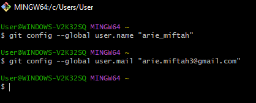
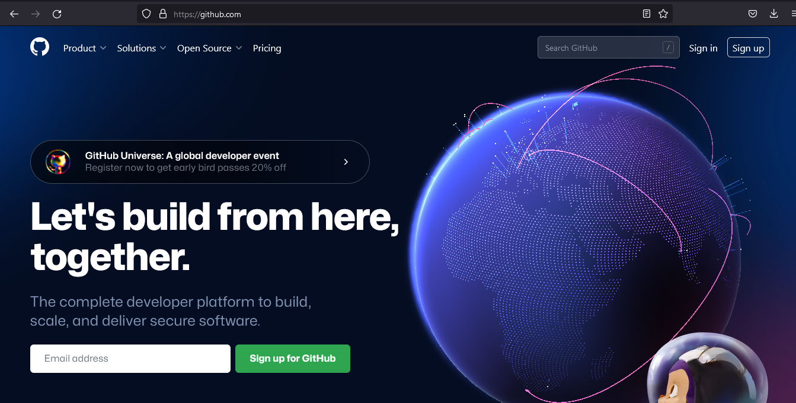
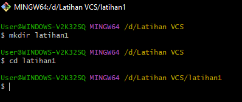
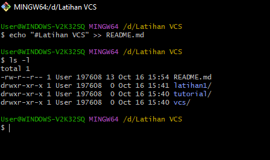
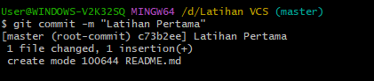
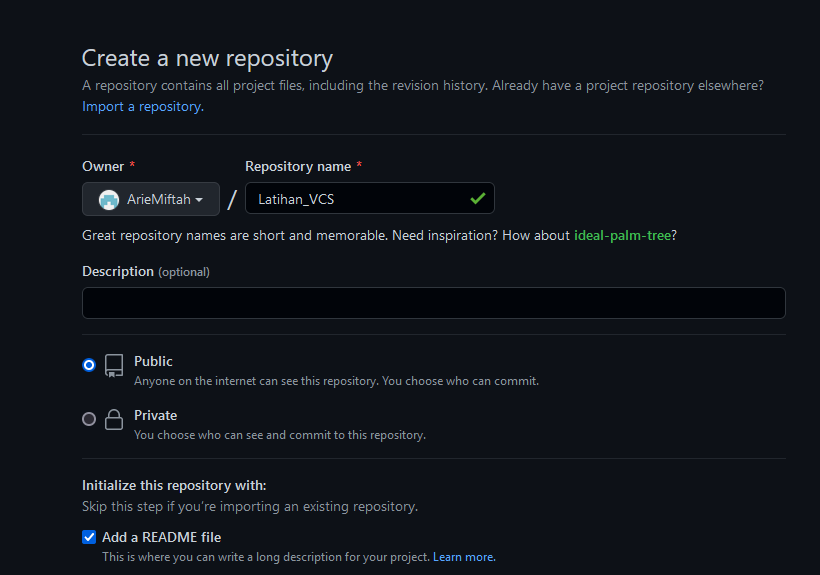
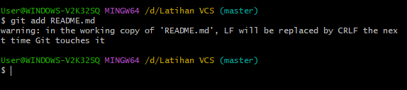
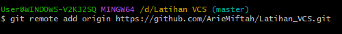
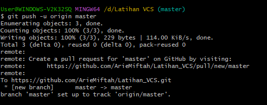
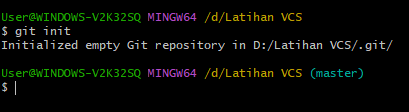

#Latihan VCS

## STEP BY STEP Latihan VCS

- Download [https://git-scm.com/downloads]

- Daftar [https://github.com/]

- Masukkan Username dan User.email

- Buat direktory project

- Membuat file README.md dan membuat judul

- Membuat repository server

- Perintahkan untuk menambahkan file baru, atau perubahan pada file

- Perintahkan untuk menyimpan perubahan kedalam database

- Perintahkan untuk menambahkan remote server/reopsitory server pada local repositry

- Perintahkan untuk membuat repository local

